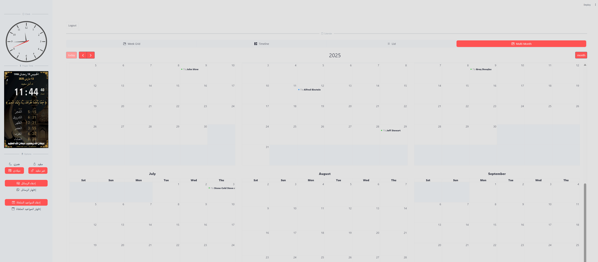

# AI-WhatsApp-Reservation-App




A powerful WhatsApp bot built using FastAPI, integrated with multiple AI providers (OpenAI, Anthropic, and Google Gemini) for generating intelligent responses to customer inquiries. The application includes a modern Next.js frontend for managing reservations and includes a fully containerized setup with Docker for easy deployment.

The bot allows users to make, modify, and cancel reservations via WhatsApp, while the front-end Next.js application provides a graphical interface for managing reservations, analyzing conversation data, and visualizing business metrics.

For the original repository and setup tutorial (Flask version), please refer to [this GitHub repository](https://github.com/daveebbelaar/python-whatsapp-bot).

## Features

- **Multi-Provider AI Integration**: Flexibility to use OpenAI, Anthropic Claude, or Google Gemini for message generation
- **Modern Frontend**: Next.js 14 application with TypeScript and Tailwind CSS for responsive UI
- **Docker Containerization**: Complete Docker setup for both development and production environments
- **Monitoring & Metrics**: Prometheus integration with alerting capabilities and Discord notifications
- **Advanced Analytics**: Comprehensive statistics dashboard for business insights
- **Automated Scheduling**: Built-in job scheduler for reminders and database backups
- **Internationalization**: Multi-language support with i18n capabilities
- **High Performance**: Optimized with uvloop for maximum throughput
- **Secure Authentication**: JWT-based authentication system for frontend access control
- **Domain-Driven Architecture**: Clean architecture with domain services for better maintainability
- **Comprehensive Testing**: Unit tests and integration tests for robust code quality
- **Production-Ready**: Support for production deployment with robust error handling and logging

## Prerequisites

- A Meta developer account. If you don't have one, [create a Meta developer account here](https://developers.facebook.com/).
- A business app. If you don't have one, [learn to create a business app here](https://developers.facebook.com/docs/development/create-an-app/).
- Docker and Docker Compose (for containerized deployment)
- Node.js 18+ and pnpm (for frontend development)
- Python 3.9+ (for backend development)
- API keys for your chosen AI provider(s): OpenAI, Anthropic, and/or Google Gemini

## Project Structure

```plaintext
├── .github/                  # GitHub workflows and CI configurations
├── app/                      # Main application code
│   ├── auth/                 # Authentication module with JWT handling
│   │   ├── deps.py          # FastAPI dependencies for authentication
│   │   ├── models.py        # Authentication models
│   │   ├── router.py        # Authentication routes
│   │   └── schemas.py       # Pydantic schemas for auth
│   ├── decorators/          # Decorator functions for security, safety, and metrics
│   ├── frontend/            # Next.js frontend application
│   │   ├── app/             # Next.js app directory structure
│   │   │   ├── api/         # API routes for Next.js
│   │   │   ├── dashboard/   # Dashboard pages
│   │   │   ├── fonts/       # Custom fonts
│   │   │   ├── globals.css  # Global CSS styles
│   │   │   └── layout.tsx   # Root layout component
│   │   ├── components/      # React components organized by feature
│   │   │   ├── animate-ui/  # Animation components
│   │   │   ├── dashboard/   # Dashboard-specific components
│   │   │   ├── glide_custom_cells/ # Custom table components
│   │   │   ├── ui/          # Reusable UI components (shadcn/ui)
│   │   │   ├── hooks/       # Custom React hooks
│   │   │   ├── lib/         # Utility libraries and configurations
│   │   │   ├── types/       # TypeScript type definitions
│   │   │   └── styles/      # CSS and styling files
│   │   ├── public/          # Static assets
│   │   ├── next.config.mjs  # Next.js configuration
│   │   ├── package.json     # Frontend dependencies
│   │   ├── tailwind.config.ts # Tailwind CSS configuration
│   │   └── tsconfig.json    # TypeScript configuration
│   ├── services/            # Business logic modules with domain-driven design
│   │   ├── domain/          # Domain layer with business logic
│   │   │   ├── conversation/ # Conversation management
│   │   │   ├── customer/    # Customer management
│   │   │   ├── notification/ # Notification services
│   │   │   ├── reservation/ # Reservation management
│   │   │   └── shared/      # Shared domain utilities
│   │   ├── anthropic_service.py # Anthropic Claude integration
│   │   ├── gemini_service.py    # Google Gemini integration
│   │   ├── openai_service.py    # OpenAI integration
│   │   ├── llm_service.py       # Abstract LLM service interface
│   │   └── assistant_functions.py # Core business logic for reservations
│   ├── utils/               # Utility functions for services and API interactions
│   ├── config.py            # Configuration settings loaded from environment variables
│   ├── db.py                # Database connection and schema definitions using SQLite
│   ├── i18n.py              # Internationalization support
│   ├── metrics.py           # Prometheus metrics definitions
│   ├── scheduler.py         # Background job scheduler for automated tasks
│   └── views.py             # FastAPI route definitions
├── prometheus/              # Prometheus monitoring stack
│   ├── prometheus.yml       # Main Prometheus configuration
│   ├── alert_rules.yml      # Alert rules definitions
│   └── alertmanager.yml     # Alert manager configuration
├── scripts/                 # Utility scripts (deploy, backups, reminders)
├── tests/                   # Test suite
│   ├── unit/                # Unit tests for individual components
│   └── integration/         # Integration tests
├── docker-compose.yml       # Development Docker Compose configuration
├── docker-compose.prod.yml  # Production Docker Compose configuration
├── docker-compose.override.yml # Development overrides
├── Dockerfile.backend       # Dockerfile for FastAPI backend
├── pyproject.toml           # Python project configuration with dependencies
├── biome.json               # Code formatting and linting configuration
├── knip.json               # Unused dependency checker configuration
├── pnpm-workspace.yaml      # pnpm workspace configuration
├── package.json            # Root package.json for monorepo management
├── pnpm-lock.yaml          # pnpm lock file
├── threads_db.sqlite       # SQLite database file
├── run.py                  # Entry point to run the FastAPI application
└── README.md               # Project documentation
```

## Overall Operation

The application operates as follows:

1. **Webhook Handling**:
   - The FastAPI application listens for incoming webhooks from WhatsApp at the `/webhook` endpoint.
   - Incoming requests are verified using signature verification to ensure authenticity.

1. **Message Processing**:
   - When a message is received, it is processed by the appropriate LLM service (OpenAI, Anthropic, or Gemini).
   - The application uses a configurable LLM provider to generate intelligent responses based on message content.

1. **Database Interactions**:
   - The application uses SQLite to store conversation history, reservation details, and thread information.
   - Multiple tables track different aspects of the business operations.

1. **Reservation Management**:
   - Users can interact with the bot via WhatsApp to make, modify, or cancel reservations.
   - Assistant functions handle these operations with natural language understanding.

1. **Monitoring and Metrics**:
   - Prometheus collects and stores metrics on system performance and business operations.
   - Alerts are configured for critical conditions and sent to a Discord channel.

1. **Frontend Dashboard**:
   - The Next.js application provides multiple views:
     - Calendar view for reservation management
     - Conversation history browser
     - Statistics dashboard with business analytics
     - WhatsApp message sending interface

1. **Automated Tasks**:
   - Background scheduler runs daily to send appointment reminders via WhatsApp.
   - Regular database backups are performed and can be uploaded to remote storage.

## Architecture Overview

### Domain-Driven Design

The application follows Domain-Driven Design (DDD) principles with clear separation of concerns:

- **Domain Layer** (`app/services/domain/`): Contains business logic organized by domain entities
  - `conversation/`: Handles WhatsApp conversation management
  - `customer/`: Manages customer data and profiles
  - `reservation/`: Core reservation business logic
  - `notification/`: Handles various notification types
  - `shared/`: Common domain utilities and base classes

- **Service Layer**: AI providers and external integrations

- **Infrastructure Layer**: Database, authentication, and external APIs

- **Presentation Layer**: Next.js frontend with modern React patterns

### Testing Strategy

The project includes comprehensive testing:

- **Unit Tests** (`tests/unit/`): Test individual components and functions
- **Integration Tests** (`tests/`): Test component interactions and API endpoints
- **Frontend Tests**: Component and integration tests for React components

## Setup and Installation

### Docker Setup (Recommended)

1. **Clone the Repository**

```bash
git clone https://github.com/your-repo/ai-whatsapp-bot.git
cd ai-whatsapp-bot
```

1. **Configure Environment Variables**

Create a `.env` file based on `.env.example` and update the necessary variables:

```env
# AI Provider API Keys
OPENAI_API_KEY=your_openai_key
ANTHROPIC_API_KEY=your_anthropic_key
GEMINI_API_KEY=your_gemini_key

# WhatsApp API Configuration
ACCESS_TOKEN=your_whatsapp_access_token
PHONE_NUMBER_ID=your_whatsapp_phone_id
VERIFY_TOKEN=your_webhook_verify_token
APP_ID=your_meta_app_id
APP_SECRET=your_meta_app_secret

# Business Information
BUSINESS_NAME=your_business_name
BUSINESS_ADDRESS=your_business_address
BUSINESS_LATITUDE=your_latitude
BUSINESS_LONGITUDE=your_longitude

# LLM Configuration
PREFERRED_LLM=openai  # Options: openai, anthropic, gemini
SYSTEM_PROMPT=your_system_prompt

# Monitoring
DISCORD_WEBHOOK_URL=your_discord_webhook_url
```

1. **Start the Application with Docker Compose**

For development:

```bash
docker-compose up
```

For production:

```bash
docker-compose -f docker-compose.prod.yml up -d
```

### Manual Setup (Alternative)

1. **Install Backend Dependencies**

```bash
pip install -r requirements-backend.in
```

1. **Install Frontend Dependencies**

```bash
cd app/frontend
pnpm install
```

1. **Run the FastAPI Application**

```bash
python run.py
```

Runs on `http://0.0.0.0:8000` by default.

1. **Run the Next.js Frontend**

```bash
cd app/frontend
pnpm run dev
```

Access at `http://localhost:3000` (default Next.js port).

### Development Scripts

The project includes various development scripts:

**Backend:**

```bash
python run.py                    # Start FastAPI server
python -m pytest tests/          # Run backend tests
```

**Frontend:**

```bash
cd app/frontend
pnpm run dev                    # Start development server
pnpm run build                  # Build for production
pnpm run lint                   # Run ESLint
pnpm run type-check             # Run TypeScript type checking
```

**Docker:**

```bash
docker-compose up               # Start all services
docker-compose -f docker-compose.prod.yml up -d  # Start production stack
```

**Code Quality:**

```bash
biome check .                   # Check code formatting and linting
biome format .                  # Format code
knip                            # Check for unused dependencies
```

## Webhook Configuration

Configure the WhatsApp webhook to point to your FastAPI application's `/webhook` endpoint. For local testing, you can use ngrok:

```bash
ngrok http 8000
```

Then configure your webhook URL as: `https://your-ngrok-url.ngrok.io/webhook`

## Monitoring and Alerts

The application includes a complete monitoring stack:

1. **Prometheus**: Collects metrics at <http://localhost:9090>
1. **AlertManager**: Manages alert notifications at <http://localhost:9093>
1. **Discord Alerts**: Sends formatted alert notifications to Discord

## Contributing

Contributions are welcome! Please follow these steps:

1. Fork the repository
1. Create a feature branch
1. Make your changes
1. Submit a pull request

## License

This project is licensed under the MIT License. See the `LICENSE.txt` file for details.
