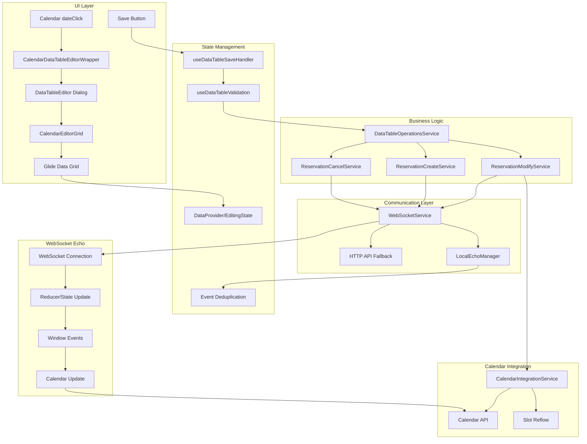
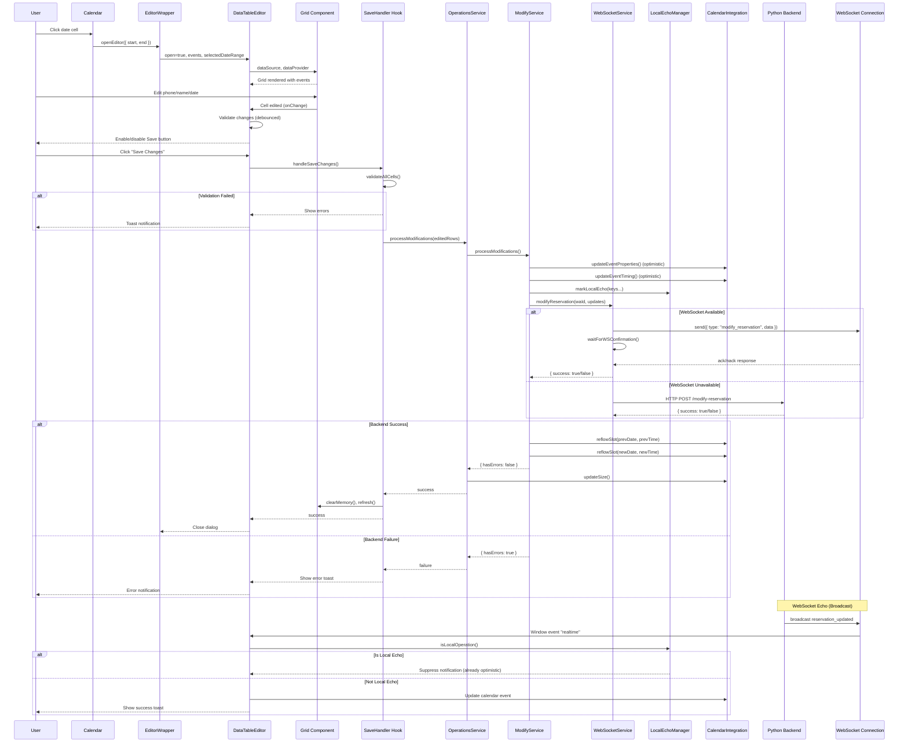

# Analysis: Calendar DataGrid Modification Flow

**Date:** 2025-01-18
**Task:** Analyze the complete frontend flow for modifying phone, name, or date in the calendar's data grid dialog (dateClick → dialog → grid → save → database)
**Scope:** Frontend-only flow including services, WebSocket communication, deduplication, and all modification paths
**Author:** Claude Sonnet 4.5

---

## Table of Contents

1. [Summary](#summary)
2. [System Context](#system-context-mermaid-diagram)
3. [End-to-End Sequence](#end-to-end-sequence-mermaid-sequence)
4. [ASCII Flow](#ascii-flow-overview-big-picture)
5. [Data Structures](#data-structures-and-type-definitions)
6. [Imports & Dependencies](#import-and-dependency-chain)
7. [File-by-File Table](#file-by-file-table-with-code-snippets)
8. [Complete Code Path](#complete-code-path-with-full-quotes)
9. [Constants & Configuration](#configuration-and-constants)
10. [Request/Response Payloads](#full-requestresponse-payloads)
11. [Error Handling](#error-handling-and-edge-cases)
12. [Observability](#observable-points-and-debugging)
13. [Invariants](#invariants-and-safety-guarantees)
14. [Risks](#risks-and-mitigations)
15. [Recommendations](#actionable-findings-and-improvements)

---

## Summary

- **Entry point**: Calendar `dateClick` callback opens DataTableEditor dialog with selected date range
- **Main components**: CalendarDataTableEditorWrapper → DataTableEditor → CalendarEditorGrid → Grid (Glide Data Grid)
- **Save flow**: User clicks "Save Changes" → validation → extract changes → process modifications/additions/cancellations → WebSocket/HTTP fallback → local echo → optimistic UI updates → slot reflow
- **WebSocket communication**: Modifications sent via WebSocket with ack/nack confirmation, HTTP fallback if WebSocket unavailable
- **Deduplication**: Local echo marking prevents duplicate notifications, getReservationKey ensures event identity during concurrent edits
- **Critical side-effects**: Calendar event updates, slot reflow for deterministic ordering, customer data refresh, editing state cleanup

---

## System Context (Mermaid Diagram)



---

## End-to-End Sequence (Mermaid Sequence)



---

## ASCII Flow Overview (Big Picture)

```
[User Interaction: dateClick]
    ↓
[Calendar Callbacks: openEditor({ start, end })]
    ↓
[CalendarDataTableEditorWrapper: render LazyDataTableEditor]
    ↓
[DataTableEditor Dialog Opens]
    ├─ Events transformed → DataSource
    ├─ Grid rendered with DataProvider
    └─ Validation hooks initialized
        ↓
[User Edits Cell: phone/name/date]
    ↓
[EditingState tracks changes]
    ├─ Debounced validation (100ms)
    ├─ Save button enabled/disabled
    └─ Validation errors shown
        ↓
[User Clicks "Save Changes"]
    ↓
[useDataTableSaveHandler.handleSaveChanges()]
    ├─ Extract editingState.toJson(columns)
    ├─ Parse to EditingChanges { edited_rows, added_rows, deleted_rows }
    └─ Call DataTableOperationsService
        ↓
[DataTableOperationsService orchestrates operations]
    ├─ processCancellations() → ReservationCancelService
    ├─ processModifications() → ReservationModifyService
    └─ processAdditions() → ReservationCreateService
        ↓
[ReservationModifyService.processModifications()]
    ├─ Prepare modification data (date, time, title, type)
    ├─ Apply optimistic UI updates (calendar event props + timing)
    ├─ Mark local echo keys (prevent duplicate notifications)
    ├─ Reflow previous slot (deterministic ordering)
    └─ Call WebSocketService.modifyReservation()
        ↓
[WebSocketService.modifyReservation()]
    ├─ Try WebSocket: send({ type: "modify_reservation", data })
    │   └─ Wait for ack/nack (10s timeout)
    └─ Fallback: HTTP POST /modify-reservation
        ↓
[Backend Processing (Python)]
    ├─ Validate request
    ├─ Update database
    ├─ Broadcast WebSocket: reservation_updated
    └─ Return { success: true/false, message }
        ↓
[Frontend receives response]
    ├─ Success: Reflow new slot, track operation, update calendar
    ├─ Failure: Revert optimistic changes, show error toast
    └─ Clear editing state, refresh grid
        ↓
[WebSocket Echo Broadcast]
    ├─ Backend sends reservation_updated to all clients
    ├─ Reducer updates state
    ├─ Window event dispatched
    ├─ LocalEchoManager checks if local operation
    │   ├─ Local: Suppress notification (already applied)
    │   └─ Remote: Apply update + show toast
    └─ Calendar updates via FullCalendar API
        ↓
[Dialog Closes]
    └─ Calendar shows updated events with correct ordering
```

---

## Data Structures and Type Definitions

### CalendarEvent (DataTable)

**File:** `app/frontend/widgets/data-table-editor/types.ts` (lines 3-19)

```typescript
export interface CalendarEvent {
  id: string;
  title: string;
  start: string;
  end?: string;
  type: "reservation" | "conversation" | "cancellation";
  extendedProps?: {
    description?: string;
    customerName?: string;
    phone?: string;
    waId?: string;
    status?: string;
    type?: number;
    cancelled?: boolean;
    reservationId?: number | undefined;
  };
}
```

### EditingChanges

**File:** `app/frontend/widgets/data-table-editor/types.ts` (lines 59-69)

```typescript
export interface EditingChanges {
  deleted_rows?: number[];
  edited_rows?: Record<string, Record<string, unknown>>;
  added_rows?: Array<{
    date: string;
    time: string;
    phone: string;
    type: string;
    name: string;
  }>;
}
```

### ValidationResult

**File:** `app/frontend/widgets/data-table-editor/types.ts` (lines 49-57)

```typescript
export interface ValidationResult {
  isValid: boolean;
  errors: Array<{
    row: number;
    col: number;
    message: string;
    fieldName?: string;
  }>;
}
```

### WebSocketMessage

**File:** `app/frontend/services/websocket/websocket.service.ts` (referenced, defined in entities)

```typescript
type WebSocketMessage = {
  type: "modify_reservation" | "cancel_reservation" | "create_reservation";
  data: {
    wa_id: string;
    date: string;
    time_slot: string;
    customer_name?: string;
    type?: number;
    reservation_id?: number;
    approximate?: boolean;
    ar?: boolean;
  };
};
```

### ApiResponse

**File:** `app/frontend/entities/event/model.ts` (referenced in services)

```typescript
type ApiResponse = {
  success: boolean;
  message?: string;
  error?: string;
  id?: string | number;
};
```

### OperationResult

**File:** `app/frontend/entities/event/model.ts` (lines referenced in processes)

```typescript
type OperationResult = {
  hasErrors: boolean;
  successfulOperations: SuccessfulOperation[];
};

type SuccessfulOperation = {
  type: "create" | "modify" | "cancel";
  id: string;
  data: {
    waId: string;
    date: string;
    time: string;
    type?: number;
  };
};
```

---

## Import and Dependency Chain

### DataTableEditor Component

**File:** `app/frontend/widgets/data-table-editor/DataTableEditor.tsx` (lines 1-24)

```typescript
import type { DataEditorRef } from "@glideapps/glide-data-grid";
import { formatHijriDate } from "@shared/libs/date/hijri-utils";
import { useSettings } from "@shared/libs/state/settings-context";
import { Z_INDEX } from "@shared/libs/ui/z-index";
import { Button } from "@ui/button";
import { useDataTableDataSource } from "@widgets/data-table-editor/hooks/use-data-table-data-source";
import { useDataTableSaveHandler } from "@widgets/data-table-editor/hooks/use-data-table-save-handler";
import { useDataTableValidation } from "@widgets/data-table-editor/hooks/use-data-table-validation";
import type {
  CalendarEvent as DataTableCalendarEvent,
  DataTableEditorProps,
} from "@widgets/data-table-editor/types";
import { AnimatePresence, motion } from "framer-motion";
import { Save, X } from "lucide-react";
import dynamic from "next/dynamic";
import { useTheme } from "next-themes";
import React, {
  useCallback,
  useEffect,
  useMemo,
  useRef,
  useState,
} from "react";
import { FullscreenProvider } from "@/shared/libs/data-grid/components/contexts/FullscreenContext";
import type { DataProvider } from "@/shared/libs/data-grid/components/core/services/DataProvider";
import { createGlideTheme } from "@/shared/libs/data-grid/components/utils/streamlitGlideTheme";
import { i18n } from "@/shared/libs/i18n";
import { Spinner } from "@/shared/ui/spinner";
import { UnsavedChangesDialog } from "./data-table-editor/data-table-editor/UnsavedChangesDialog";
import { ValidationErrorsPopover } from "./data-table-editor/data-table-editor/ValidationErrorsPopover";

const Grid = dynamic(() => import("./grids/CalendarEditorGrid"), {
  ssr: false,
});
```

### useDataTableSaveHandler Hook

**File:** `app/frontend/widgets/data-table-editor/hooks/use-data-table-save-handler.ts` (lines 1-12)

```typescript
import type { DataTableOperationsService as _D } from "@processes/data-table-operations.process";
import { DataTableOperationsService } from "@processes/data-table-operations.process";
import { i18n } from "@shared/libs/i18n";
import { toastService } from "@shared/libs/toast";
import type {
  CalendarEvent,
  EditingChanges,
  ValidationResult,
} from "@widgets/data-table-editor/types";
import type React from "react";
import { useCallback, useRef, useState } from "react";
import type {
  CalendarApi as LibCalendarApi,
  CalendarEvent as LibCalendarEvent,
  RowChange,
} from "@/entities/event";
import type { IColumnDefinition } from "@/shared/libs/data-grid/components/core/interfaces/IDataSource";
import type { DataProvider } from "@/shared/libs/data-grid/components/core/services/DataProvider";
import type { BaseColumnProps } from "@/shared/libs/data-grid/components/core/types";
import type { CalendarCoreRef } from "@/widgets/calendar/CalendarCore";
```

### DataTableOperationsService

**File:** `app/frontend/processes/data-table-operations.process.ts` (lines 1-8)

```typescript
import { LocalEchoManager } from "@shared/libs/utils/local-echo.manager";
import type {
  CalendarApi,
  CalendarEvent,
  OperationResult,
  RowChange,
  SuccessfulOperation,
} from "@/entities/event";
import { CalendarIntegrationService } from "../services/calendar/calendar-integration.service";
import { ReservationCancelService } from "../services/operations/reservation-cancel.service";
import { ReservationCreateService } from "../services/operations/reservation-create.service";
import { ReservationModifyService } from "../services/operations/reservation-modify.service";
import { FormattingService } from "../services/utils/formatting.service";
import { WebSocketService } from "../services/websocket/websocket.service";
```

### ReservationModifyService

**File:** `app/frontend/services/operations/reservation-modify.service.ts` (lines 1-10)

```typescript
import { i18n } from "@shared/libs/i18n";
import { toastService } from "@shared/libs/toast";
import type {
  ApiResponse,
  CalendarEvent,
  OperationResult,
  RowChange,
  SuccessfulOperation,
} from "@/entities/event";
import { generateLocalOpKeys } from "@/shared/libs/realtime-utils";
import type { LocalEchoManager } from "@/shared/libs/utils/local-echo.manager";
import type { CalendarIntegrationService } from "../calendar/calendar-integration.service";
import type { FormattingService } from "../utils/formatting.service";
import type { WebSocketService } from "../websocket/websocket.service";
```

### WebSocketService

**File:** `app/frontend/services/websocket/websocket.service.ts` (lines 1-2)

```typescript
import {
  cancelReservation as httpCancelReservation,
  modifyReservation,
} from "@shared/libs/api";
import type { ApiResponse, WebSocketMessage } from "@/entities/event";
```

---

## File-by-File Table with Code Snippets
