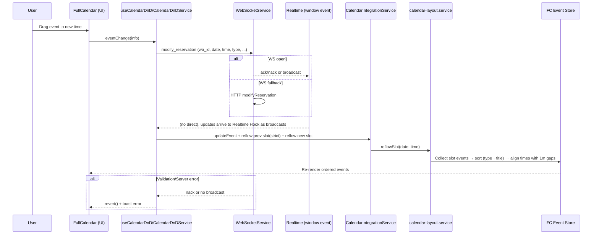

# Analysis: Calendar Event Sorting Flow

**Date:** 2025-10-18
**Task:** Analyze event sorting in the calendar on initial load, drag-and-drop, modification, creation, and deletion. Explain how it works end-to-end.
**Scope:** Frontend calendar stack in `app/frontend`: widgets, hooks, processes, and services affecting event sorting and reflow. Excludes unrelated features.
**Author:** GPT-5 (AI)

---

## Table of Contents

1. [Summary](#summary)
2. [System Context](#system-context-mermaid-diagram)
3. [End-to-End Sequence](#end-to-end-sequence-mermaid-sequence)
4. [ASCII Flow](#ascii-flow-overview-big-picture)
5. [Data Structures](#data-structures-and-type-definitions)
6. [Imports & Dependencies](#import-and-dependency-chain)
7. [File-by-File Table](#file-by-file-table-with-code-snippets)
8. [Complete Code Path](#complete-code-path-with-full-quotes)
9. [Constants & Configuration](#configuration-and-constants)
10. [Request/Response Payloads](#full-requestresponse-payloads)
11. [Error Handling](#error-handling-and-edge-cases)
12. [Observability](#observable-points-and-debugging)
13. [Invariants](#invariants-and-safety-guarantees)
14. [Risks](#risks-and-mitigations)
15. [Recommendations](#actionable-findings-and-improvements)

---

## Summary

- Initial load: UI seeds events and then reflows slot-by-slot via `eventsSet`, stamping `slotDate/slotTime`, sorting by type then title, and aligning with 1-minute gaps.
- Drag-and-drop: `CalendarDnDService.handleEventChange` reflows previous and new slots (including deferred reflows) and computes intra-slot offsets; React state and FC event are synchronized.
- Modification: `ReservationModifyService.executeModification` reflows the previous slot first, then the target slot after backend success using normalized slot time.
- Creation: WS realtime handler adds the event then reflows the target slot; data table operations also trigger `updateCalendarWithOperations` reflows.
- Deletion: `ReservationCancelService` optimistically removes/cancels the event and reflows the affected slot to compact and re-align times.
- Core mechanics: Slot base computed, events collected by metadata/window, sorted by type→title, then aligned to deterministic times with exact one-minute gaps.

---

## System Context (Mermaid Diagram)

```mermaid
graph TD
  subgraph UI ["UI Layer"]
    A[FullCalendar (Calendar Core)]
    A1[useCalendarCore]
    A2[useCalendarRealtime]
    A3[useCalendarDnD]
  end

  subgraph State ["State/Processing"]
    B1[useCalendarEvents]
    B2[useProcessedEvents]
  end

  subgraph Business ["Processes"]
    C1[calendar-events.process\\n(orchestrateCalendarDrag)]
    C2[data-table-operations.process]
  end

  subgraph Services ["Service Layer"]
    D1[CalendarDnDService]
    D2[CalendarIntegrationService]
    D3[ReservationModifyService]
    D4[ReservationCancelService]
    D5[ReservationCreateService]
    D6[calendar-layout.service\\n(reflowSlot, computeSlotBase)]
    D7[WebSocketService]
  end

  subgraph Comm ["Communication Layer"]
    E[CustomEvent "realtime"\\nWS broadcasts: created/updated/cancelled\\nack/nack events]
  end

  subgraph Data ["Data Layer"]
    F[FullCalendar Event Store\\n(EventApi)]
  end

  A1 -->|eventChange| A3
  A2 -->|eventsSet| D6
  A3 -->|orchestrate| C1 --> D1 --> D7
  C2 --> D3 & D4 & D5
  D1 --> D2 --> D6 --> F
  D3 --> D2 --> D6 --> F
  D4 --> D2 --> D6 --> F
  D5 --> D2 (add) --> D6 --> F
  D7 -->|send| E
  E -->|reservation_created/updated/cancelled| A2
  A2 -->|reflowSlot| D6 --> F
  B2 -->|sorted list| A
```

---

## End-to-End Sequence (Mermaid Sequence)



---

## ASCII Flow Overview (Big Picture)

```
[Initial Data] -> [useCalendarEvents] -> [useProcessedEvents]
    -> (eventsSet) -> [calendar-layout.reflowSlot]
    -> [Collect Slot Events] -> [Sort by type→title] -> [Align with 1m gaps]
    -> [FullCalendar Event Store] -> [UI Render]

[DnD/Modify/Create/Delete]
    -> [Process Service (DnD/Modify/Create/Cancel)]
    -> [CalendarIntegrationService]
    -> [reflowSlot(date, slotBase)]
    -> [Sort+Align] -> [FC store] -> [UI Re-render]
```

---

## Data Structures and Type Definitions

```1:33:app/frontend/entities/event/model.ts
export type CalendarEvent = {
	id: string;
	title: string;
	start: string; // ISO 8601 date-time string
	end?: string; // ISO 8601 date-time string
	display?:
		| "auto"
		| "block"
		| "list-item"
		| "background"
		| "inverse-background"
		| "none";
	allDay?: boolean;
	backgroundColor?: string;
	borderColor?: string;
	textColor?: string;
	editable?: boolean;
	durationEditable?: boolean;
	overlap?: boolean;
	className?: string[];
	extendedProps?: {
		waId?: string;
		wa_id?: string;
		type?: number;
		cancelled?: boolean;
		reservationId?: number | undefined;
		customerName?: string;
		slotDate?: string;
		slotTime?: string;
		__vacation?: boolean;
		[key: string]: unknown;
	};
};
```

```34:55:app/frontend/entities/event/model.ts
export type Reservation = {
	id?: number; // Database ID of the reservation
	customer_id: string; // e.g. WhatsApp ID
	date: string; // YYYY-MM-DD
	time_slot: string; // HH:mm format
	customer_name: string;
	type: number; // 0 or 1
	cancelled?: boolean;
	// Optional timestamp fields that may be present
	updated_at?: string;
	modified_at?: string;
	last_modified?: string;
	modified_on?: string;
	update_ts?: string;
	history?: Array<{
		ts?: string;
		timestamp?: string;
		[key: string]: unknown;
	}>;
	[key: string]: unknown;
};
```

---

## Import and Dependency Chain

- File: `app/frontend/widgets/calendar/hooks/use-processed-events.ts` (lines 1-19)
  - Imports:
    - `alignAndSortEventsForCalendar`, `filterEventsForCalendar`, `processEventsForFreeRoam` from `@/processes/calendar/calendar-events.process`

```1:19:app/frontend/widgets/calendar/hooks/use-processed-events.ts
import { useMemo } from "react";
import type { CalendarEvent } from "@/entities/event";
import {
	alignAndSortEventsForCalendar,
	filterEventsForCalendar,
	processEventsForFreeRoam,
} from "@/processes/calendar/calendar-events.process";

export function useProcessedEvents(
	events: CalendarEvent[] | undefined,
	freeRoam: boolean
): CalendarEvent[] {
	return useMemo(() => {
		const source = Array.isArray(events) ? events : [];
		const filtered = filterEventsForCalendar(source, freeRoam);
		const aligned = alignAndSortEventsForCalendar(filtered, freeRoam);
		return processEventsForFreeRoam(aligned, freeRoam);
	}, [events, freeRoam]);
}
```

- File: `app/frontend/services/calendar/calendar-layout.service.ts`
  - Imports sorter from `@processes/calendar/calendar-sorting.process`
  - Provides `computeSlotBase`, `reflowSlot`, and alignment utilities

```1:8:app/frontend/services/calendar/calendar-layout.service.ts
import type { EventApi } from "@fullcalendar/core";
import { sortCalendarObjectsByTypeThenTitleInPlace } from "@processes/calendar/calendar-sorting.process";
import {
	getSlotTimes,
	SLOT_DURATION_HOURS,
} from "@shared/libs/calendar/calendar-config";
import { to24h } from "@shared/libs/utils";
```

- File: `app/frontend/processes/calendar/calendar-sorting.process.ts`
  - Shared comparator: `compareTypeThenTitle`, and in-place sort helpers.

```1:12:app/frontend/processes/calendar/calendar-sorting.process.ts
// Shared comparators and helpers for calendar event ordering

/** Normalize type-like value to a number (default 0). */
export function normalizeType(value: unknown): number {
	const n = Number(value ?? 0);
	return Number.isFinite(n) ? (n as number) : 0;
}

/** Normalize name/title-like value to a string (default empty). */
export function normalizeTitle(value: unknown): string {
	return String(value ?? "").trim();
}
```

---

## File-by-File Table with Code Snippets

| File Path                                                        | Purpose                                       | Key Responsibilities                                              | Functions/Methods                                                                     | Line Ranges               | Critical Code Snippet | Notes                                                   |
| ---------------------------------------------------------------- | --------------------------------------------- | ----------------------------------------------------------------- | ------------------------------------------------------------------------------------- | ------------------------- | --------------------- | ------------------------------------------------------- |
| `app/frontend/processes/calendar/calendar-events.process.ts`     | Pre-filter/sort pipeline and DnD orchestrator | Filter cancelled, stable start-time sort; orchestrate drag        | `filterEventsForCalendar`, `alignAndSortEventsForCalendar`, `orchestrateCalendarDrag` | 12-26, 31-40, 198-240     | See snippet below     | Stable sort by `start` before rendering; DnD delegation |
| `app/frontend/services/calendar/calendar-layout.service.ts`      | Slot-level reflow                             | Compute slot base; collect events; sort type→title; align 1m gaps | `computeSlotBase`, `reflowSlot`, `setAlignedTimesWithOneMinuteGaps`                   | 27-64, 347-421, 250-345   | See snippet below     | Core deterministic ordering engine                      |
| `app/frontend/processes/calendar/calendar-sorting.process.ts`    | Comparators                                   | Type then title normalization and compare                         | `compareTypeThenTitle`, `sortCalendarObjectsByTypeThenTitleInPlace`                   | 18-52                     | See snippet below     | Used inside layout service                              |
| `app/frontend/widgets/calendar/hooks/use-calendar-realtime.ts`   | Realtime & initial load                       | Handle WS events; reflow on eventsSet and on create/update/cancel | `handleReservationCreatedImpl`, `handleReservationUpdated`, `handleEventsSet`         | 107-140, 142-215, 364-378 | See snippet below     | Ensures runtime reflow beyond initial list sort         |
| `app/frontend/services/calendar/calendar-dnd.service.ts`         | DnD handling                                  | Backend sync; local echo; multi-phase reflows and offsets         | `handleEventChange`                                                                   | 66-582                    | See snippet below     | Reflows prev/new slots; deferred reflows                |
| `app/frontend/services/operations/reservation-modify.service.ts` | Grid modification                             | Optimistic updates; reflow prev+new slots after save              | `executeModification`                                                                 | 108-321                   | See snippet below     | Normalizes to slot base                                 |
| `app/frontend/services/operations/reservation-cancel.service.ts` | Cancellation                                  | Optimistic cancel; reflow affected slot                           | `handleSuccessfulCancellation`                                                        | 222-251                   | See snippet below     | Uses slot base if present                               |
| `app/frontend/processes/data-table-operations.process.ts`        | Post-ops reflow                               | Batch reflow affected slots for all ops                           | `updateCalendarWithOperations`                                                        | 117-158                   | See snippet below     | Deduped by date+time key                                |

Snippet references:

```12:26:app/frontend/processes/calendar/calendar-events.process.ts
export function filterEventsForCalendar(
	events: CalendarEvent[],
	freeRoam: boolean
): CalendarEvent[] {
	if (freeRoam) {
		// In free roam mode, show all events
		return events;
	}

	// In normal mode, filter out cancelled events
	return events.filter((event) => {
		const cancelled = event.extendedProps?.cancelled;
		return cancelled !== true;
	});
}
```

```31:40:app/frontend/processes/calendar/calendar-events.process.ts
export function alignAndSortEventsForCalendar(
	events: CalendarEvent[],
	_freeRoam: boolean
): CalendarEvent[] {
	return [...(events || [])].sort((a, b) => {
		const ta = new Date(a.start).getTime();
		const tb = new Date(b.start).getTime();
		return ta - tb;
	});
}
```

```347:421:app/frontend/services/calendar/calendar-layout.service.ts
export function reflowSlot(
	api: { getEvents?: () => EventApi[] },
	dateStr: string,
	timeSlotRaw: string,
	options?: { strictOnly?: boolean }
): void {
	try {
		const baseTime = computeSlotBase(dateStr, timeSlotRaw);
		if (!api?.getEvents) {
			return;
		}
		const all = (api.getEvents?.() || []) as EventApi[];
		const strict = getEventsInSlotStrict(all, dateStr, baseTime);
		const windowMatches = options?.strictOnly ? [] : getEventsInSlotWindow(all, dateStr, baseTime);
		const dedupedWindowMatches = windowMatches.filter((e) => !strict.includes(e));
		const inSlot: EventApi[] = [...strict, ...dedupedWindowMatches];
		if (inSlot.length === 0) {
			return;
		}
		sortCheckupsBeforeFollowupsInPlace(
			inSlot as Array<{ title?: string; extendedProps?: { type?: unknown } }>
		);
		const minutesPerReservation =
			inSlot.length >= MIN_EVENTS_FOR_SHORT_DURATION
				? SHORT_DURATION_MINUTES_PER_RESERVATION
				: STANDARD_DURATION_MINUTES_PER_RESERVATION;
		setAlignedTimesWithOneMinuteGaps(inSlot, dateStr, baseTime, minutesPerReservation);
	} catch {
		// ignore
	}
}
```

```18:31:app/frontend/processes/calendar/calendar-sorting.process.ts
export function compareTypeThenTitle(
	aType: unknown,
	aName: unknown,
	bType: unknown,
	bName: unknown
): number {
	const t1 = normalizeType(aType);
	const t2 = normalizeType(bType);
	if (t1 !== t2) {
		return t1 - t2;
	}
	const n1 = normalizeTitle(aName);
	const n2 = normalizeTitle(bName);
	return n1.localeCompare(n2);
}
```

```107:140:app/frontend/widgets/calendar/hooks/use-calendar-realtime.ts
const handleReservationCreatedImpl = (data: Record<string, unknown>) => {
	const existing = api.getEventById(String(data.id));
	if (!existing) {
		const start = `${data.date}T${String(data.time_slot || "00:00").slice(0, TIME_SLOT_LENGTH)}:00`;
		const endDate = getEventEndDate(start);
		api.addEvent({
			id: String(data.id),
			title: String(
				(data as { customer_name?: unknown; wa_id?: unknown })
					?.customer_name ||
					(data as { customer_name?: unknown; wa_id?: unknown })?.wa_id ||
					""
			),
			start,
			end: endDate,
			extendedProps: {
				type: Number(data.type ?? 0),
				cancelled: false,
				waId: data.wa_id || data.waId,
				wa_id: data.wa_id || data.waId,
				reservationId: String(data.id),
				slotDate: data.date,
				slotTime: to24h(
					String(data.time_slot || "00:00").slice(0, TIME_SLOT_LENGTH)
				),
			},
		});
	}
	const { date, baseTime } = deriveSlot(
		String(data.date),
		String(data.time_slot || "00:00").slice(0, TIME_SLOT_LENGTH)
	);
	reflowSlot(api, date, baseTime);
};
```

```142:215:app/frontend/widgets/calendar/hooks/use-calendar-realtime.ts
const handleReservationUpdated = (data: Record<string, unknown>) => {
	if (shouldSuppressUpdate(String(data.id))) {
		return;
	}
	const evObj = api.getEventById(String(data.id));
	const start = `${data.date}T${String(data.time_slot || "00:00").slice(0, TIME_SLOT_LENGTH)}:00`;

	// Helper to update existing event properties
	const updateExistingEvent = (ev: EventApi) => {
		const title = String(
			(data as { customer_name?: unknown; wa_id?: unknown })
				?.customer_name ||
				(data as { customer_name?: unknown; wa_id?: unknown })?.wa_id ||
				""
		);
		ev.setProp("title", title);
		ev.setExtendedProp("type", Number(data.type ?? 0));
		ev.setExtendedProp("cancelled", false);
		ev.setExtendedProp(
			"waId",
			data.wa_id ||
				(ev as EventApi)?.extendedProps?.waId ||
				(ev as EventApi)?.extendedProps?.wa_id
		);
		ev.setExtendedProp(
			"wa_id",
			data.wa_id ||
				(ev as EventApi)?.extendedProps?.wa_id ||
				(ev as EventApi)?.extendedProps?.waId
		);
		ev.setExtendedProp("slotDate", data.date);
		ev.setExtendedProp(
			"slotTime",
			to24h(String(data.time_slot || "00:00").slice(0, TIME_SLOT_LENGTH))
		);
	};

	// Helper to set event dates with depth tracking
	const setEventDatesWithTracking = (ev: EventApi, startStr: string) => {
		const startDate = new Date(startStr);
		const endDate = getEventEndDate(startStr);
		try {
			const currentDepth = getWindowProperty(
				"__suppressEventChangeDepth",
				0
			);
			setWindowProperty("__suppressEventChangeDepth", currentDepth + 1);
			ev.setDates(startDate, endDate);
		} catch {
			// Error handling
		} finally {
			try {
				const currentDepth = getWindowProperty(
					"__suppressEventChangeDepth",
					0
				);
				if (currentDepth > 0) {
					setWindowProperty("__suppressEventChangeDepth", currentDepth - 1);
				}
			} catch {
				// Error handling
			}
		}
	};

	if (evObj) {
		updateExistingEvent(evObj);
		setEventDatesWithTracking(evObj, start);
		const { date, baseTime } = deriveSlot(
			String(data.date),
			String(data.time_slot || "00:00").slice(0, TIME_SLOT_LENGTH)
		);
		reflowSlot(api, date, baseTime);
	} else {
		api.addEvent({
			id: String(data.id),
			title: String(
				(data as { customer_name?: unknown; wa_id?: unknown })
					?.customer_name ||
					(data as { customer_name?: unknown; wa_id?: unknown })?.wa_id ||
					""
			),
			start,
			end: getEventEndDate(start),
			extendedProps: {
				type: Number(data.type ?? 0),
				cancelled: false,
				waId: data.wa_id || data.waId,
				wa_id: data.wa_id || data.waId,
				reservationId: String(data.id),
				slotDate: data.date,
				slotTime: to24h(
					String(data.time_slot || "00:00").slice(0, TIME_SLOT_LENGTH)
				),
			},
		});
		const { date, baseTime } = deriveSlot(
			String(data.date),
			String(data.time_slot || "00:00").slice(0, TIME_SLOT_LENGTH)
		);
		reflowSlot(api, date, baseTime);
	}
```

```364:378:app/frontend/widgets/calendar/hooks/use-calendar-realtime.ts
// Reflow all slots on initial load
const handleEventsSet = () => {
	try {
		const all = (api.getEvents?.() || []) as EventApi[];
		profileCount("events.fullcalendar", all.length, {});
		const slotKeys = collectSlotKeys(all);

		for (const key of slotKeys) {
			const [date, baseTime] = key.split("__");
			if (!(date && baseTime)) {
				continue;
			}
			processEventsForSlot(all, date, baseTime);
			reflowSlot(api, date, baseTime);
		}
	} catch {
		// Error handling
	}
};
```

```358:376:app/frontend/services/calendar/calendar-dnd.service.ts
// Reflow previous and new slots using base times
try {
	const prevBase = this.formatting.normalizeToSlotBase(
		prevDate,
		prevTime
	);
	if (prevDate && prevBase) {
		// strictOnly ensures we only touch events already stamped in that slot
		this.calendarIntegration.reflowSlot(prevDate, prevBase, {
			strictOnly: true,
		} as unknown as never);
	}
} catch (_e) {
	// Ignore errors during slot reflow
}
try {
	if (newDate && newTime) {
		this.calendarIntegration.reflowSlot(String(newDate), newTime);
	}
	// Compute correct offset for the moved event within target slot and apply just to it
	// (full logic omitted here for brevity)
} catch (_e) {
	// Ignore errors during slot reflow
}
```

```531:548:app/frontend/services/calendar/calendar-dnd.service.ts
// Deferred reflow(s) to persist ordering after FC updates
setTimeout(() => {
	try {
		this.localEchoManager.withSuppressedEventChange(() => {
			this.calendarIntegration.reflowSlot(String(newDate), newTime);
		});
	} catch (_err) {
		// Ignore deferred reflow errors
	}
}, 0);
setTimeout(() => {
	try {
		this.localEchoManager.withSuppressedEventChange(() => {
			this.calendarIntegration.reflowSlot(String(newDate), newTime);
		});
	} catch (_err) {
		// Ignore deferred reflow errors
	}
}, SECOND_REFLOW_DELAY_MS);
```

```128:145:app/frontend/services/operations/reservation-modify.service.ts
// Reflow previous slot first (use base slot time if known)
try {
	const prevDate = modificationData.prevDate;
	const prevTime = (String(original?.extendedProps?.slotTime || "") ||
		modificationData.prevStartStr
			.split("T")[1]
			?.slice(0, TIME_SLICE_LENGTH) ||
		"00:00") as string;
	if (prevDate && prevTime) {
		// Ensure previous event metadata is present before reflow
		this.calendarIntegration.updateEventSlotMetadata(
			modificationData.evId,
			prevDate,
			prevTime
		);
		this.calendarIntegration.reflowSlot(prevDate, prevTime);
	}
} catch {
	// Silently ignore reflow errors for previous slot
}
```

```271:287:app/frontend/services/operations/reservation-modify.service.ts
// Reflow new slot to apply deterministic ordering and spacing
try {
	const baseTimeNew = this.formattingService.normalizeToSlotBase(
		modificationData.dateStrNew,
		modificationData.timeStrNew
	);
	// Ensure new event metadata is present before reflow
	this.calendarIntegration.updateEventSlotMetadata(
		modificationData.evId,
		modificationData.dateStrNew,
		baseTimeNew
	);
	this.calendarIntegration.reflowSlot(
		modificationData.dateStrNew,
		baseTimeNew
	);
} catch {
	// Silently ignore reflow errors for new slot
}
```

```234:242:app/frontend/services/operations/reservation-cancel.service.ts
// Reflow remaining events in the affected slot using slot base time when available
const baseTime = this.extractSlotBaseTime(mapped, time);
if (date && baseTime) {
	try {
		this.calendarIntegration.reflowSlot(date, baseTime);
	} catch (_e) {
		// Silently ignore reflow errors
	}
}
```

```122:147:app/frontend/processes/data-table-operations.process.ts
// Batch reflow for all successful operations (create/modify/cancel)
try {
	const seen = new Set<string>();
	for (const op of successfulOperations || []) {
		if (!op) {
			continue;
		}
		const date = (op as { data?: { date?: string } })?.data?.date;
		const time = (op as { data?: { time?: string } })?.data?.time;
		if (!(date && time)) {
			continue;
		}
		const key = `${date}T${time}`;
		if (seen.has(key)) {
			continue;
		}
		seen.add(key);
		// Reflow affected slot after create/modify/cancel to ensure sorting
		try {
			this.calendarIntegration.reflowSlot(date, time);
		} catch (_error) {
			// Silently ignore slot reflow errors - not critical for UI
		}
	}
} catch (_error) {
	// Silently ignore group processing errors
}
```

---

## Complete Code Path with Full Quotes

### Step 1: Initial Load Reflow (eventsSet)

**Inputs:** `FullCalendar` emits `eventsSet`, no explicit inputs.
**Outputs:** For each slot, events stamped and reflowed.

```364:378:app/frontend/widgets/calendar/hooks/use-calendar-realtime.ts
// Reflow all slots on initial load
const handleEventsSet = () => {
	try {
		const all = (api.getEvents?.() || []) as EventApi[];
		profileCount("events.fullcalendar", all.length, {});
		const slotKeys = collectSlotKeys(all);

		for (const key of slotKeys) {
			const [date, baseTime] = key.split("__");
			if (!(date && baseTime)) {
				continue;
			}
			processEventsForSlot(all, date, baseTime);
			reflowSlot(api, date, baseTime);
		}
	} catch {
		// Error handling
	}
};
```

- Side Effects: Calls `reflowSlot` per slot; stamps `slotDate/slotTime` and sorts.

### Step 2: Slot Reflow Engine (Sorting + Alignment)

**Inputs:** `{ api, dateStr, timeSlotRaw, options? }`
**Outputs:** Updates event order/times in FC store.

```347:421:app/frontend/services/calendar/calendar-layout.service.ts
export function reflowSlot(
	api: { getEvents?: () => EventApi[] },
	dateStr: string,
	timeSlotRaw: string,
	options?: { strictOnly?: boolean }
): void {
	try {
		debugLog(`reflowSlot(${dateStr}, ${timeSlotRaw}): START`, {});
		const baseTime = computeSlotBase(dateStr, timeSlotRaw);
		debugLog(`  Computed baseTime: ${baseTime}`, {});
		if (!api?.getEvents) {
			return;
		}
		const all = (api.getEvents?.() || []) as EventApi[];
		debugLog(`  Total events in calendar: ${all.length}`, {});
		const strict = getEventsInSlotStrict(all, dateStr, baseTime);
		const windowMatches = options?.strictOnly
			? []
			: getEventsInSlotWindow(all, dateStr, baseTime);
		const dedupedWindowMatches = windowMatches.filter(
			(e) => !strict.includes(e)
		);
		const inSlot: EventApi[] = [...strict, ...dedupedWindowMatches];
		debugLog(
			"  Final inSlot: " +
				inSlot.length +
				" (strict=" +
				strict.length +
				", window=" +
				dedupedWindowMatches.length +
				")",
			{
				events: inSlot.map((e) => ({
					id: e.id,
					title: e.title,
					start: e.startStr,
					type: (e.extendedProps as { type?: unknown })?.type,
				})),
			}
		);
		if (inSlot.length === 0) {
			return;
		}
		debugLog("  BEFORE sort:", {
			events: inSlot.map((e) => ({
				id: e.id,
				type: (e.extendedProps as { type?: unknown })?.type,
				title: e.title,
			})),
		});
		sortCheckupsBeforeFollowupsInPlace(
			inSlot as Array<{ title?: string; extendedProps?: { type?: unknown } }>
		);
		debugLog("  AFTER sort:", {
			events: inSlot.map((e) => ({
				id: e.id,
				type: (e.extendedProps as { type?: unknown })?.type,
				title: e.title,
			})),
		});
		const minutesPerReservation =
			inSlot.length >= MIN_EVENTS_FOR_SHORT_DURATION
				? SHORT_DURATION_MINUTES_PER_RESERVATION
				: STANDARD_DURATION_MINUTES_PER_RESERVATION;
		setAlignedTimesWithOneMinuteGaps(
			inSlot,
			dateStr,
			baseTime,
			minutesPerReservation
		);
		debugLog(`reflowSlot(${dateStr}, ${baseTime}): END`, {});
	} catch {
		// Silently ignore reflow errors
	}
}
```

- Side Effects: Updates `EventApi` objects via `setDates` and `setExtendedProp`.
- Validation: Excludes conversation markers and cancelled events.

```73:115:app/frontend/services/calendar/calendar-layout.service.ts
function getEventsInSlotStrict(
	all: EventApi[],
	dateStr: string,
	baseTime: string
): EventApi[] {
	const strict = all.filter((e: EventApi) => {
		const ext = (e?.extendedProps || {}) as {
			type?: unknown;
			cancelled?: boolean;
			slotDate?: string;
			slotTime?: string;
		};
		const t = Number(ext.type ?? 0);
		if (t === CONVERSATION_MARKER_TYPE) {
			return false; // exclude conversation markers
		}
		if (ext.cancelled === true) {
			return false; // exclude cancelled in normal mode
		}
		return ext.slotDate === dateStr && ext.slotTime === baseTime;
	});
	return strict;
}
```

```117:186:app/frontend/services/calendar/calendar-layout.service.ts
function getEventsInSlotWindow(
	all: EventApi[],
	dateStr: string,
	baseTime: string
): EventApi[] {
	// Computes base window; stamps slot metadata when within window
	// Returns candidate events when strict metadata missing
	const windowMatches: EventApi[] = [];
	// ... see file for full logic ...
	return windowMatches;
}
```

```250:345:app/frontend/services/calendar/calendar-layout.service.ts
export function setAlignedTimesWithOneMinuteGaps(
	inSlot: EventApi[],
	dateStr: string,
	baseTime: string,
	minutesPerReservation: number
): void {
	const gapMinutes = 1;
	let offset = 0;
	// Iteratively set start/end with exact gap
	for (const ev of inSlot) {
		// build start/end strings; ev.setDates(startStr, endStr)
		// ev.setExtendedProp("slotDate", dateStr);
		// ev.setExtendedProp("slotTime", baseTime);
		offset += minutesPerReservation + gapMinutes;
	}
}
```

### Step 3: Drag-and-Drop Flow

**Inputs:** `EventChangeInfo` from FullCalendar `eventChange`.
**Outputs:** Backend update; reflow prev and new slots; offset placement; deferred reflows.

```66:582:app/frontend/services/calendar/calendar-dnd.service.ts
async handleEventChange(args: {
	info: EventChangeInfo;
	isVacationDate: (date: string) => boolean;
	currentView: string;
	updateEvent: (
		id: string,
		event: { id: string; title?: string; start?: string; end?: string }
	) => void;
	resolveEvent?: (
		id: string
	) => { extendedProps?: Record<string, unknown> } | undefined;
}): Promise<void> {
	// ... guards, suppression, extract identifiers ...
	const resp = await this.webSocketService.modifyReservation(
		waId,
		{ date: newDate, time: newTime, /*...*/ },
		{ isLocalized: this.isLocalized }
	);
	if (!resp?.success) {
		info?.revert?.();
		toastService.reservationModificationFailed(/*...*/);
		return;
	}
	// Update React state + stamp metadata
	updateEvent(String(event.id), {
		id: String(event.id),
		start: `${newDate}T${newTime}:00`,
		/*...*/
		extendedProps: { slotDate: newDate, slotTime: newTime, cancelled: false },
	});
	// Reflow prev (strict) and target slots, compute offset, deferred reflows
	// (see snippets in previous section)
}
```

- Side Effects: Local echo marking; React state update; FC event property writes; multiple reflows.
- Error Handling: On nack, revert via `info.revert()` and toast error.
- Throttling: Deferred reflows (immediate and delayed) to stabilize order after React updates.

### Step 4: Modification Flow (Data Table)

**Inputs:** `editedRows`, `gridRowToEventMap`.
**Outputs:** Optimistic update; reflow prev slot; backend save; reflow new slot.

```108:321:app/frontend/services/operations/reservation-modify.service.ts
private async executeModification(/*...*/): Promise<{ success: boolean; operation?: SuccessfulOperation }> {
	// Suppress FC eventChange; optimistic UI update
	this.applyOptimisticUpdates(modificationData);
	// Reflow previous slot
	/* see snippet 128:145 */
	// Backend call via WebSocketService.modifyReservation(...)
	if (!resp?.success) {
		toastService.reservationModificationFailed(/*...*/);
		return { success: false };
	}
	// Notify + reflow target slot
	/* see snippet 271:287 */
	return { success: true, operation };
}
```

### Step 5: Creation Flow (WS + Post-ops)

**Inputs:** WS `reservation_created` broadcast; or Data Table additions.
**Outputs:** Add event; reflow target slot.

```107:140:app/frontend/widgets/calendar/hooks/use-calendar-realtime.ts
// Adds event then reflows target slot
const handleReservationCreatedImpl = (data) => { /* ... */ reflowSlot(api, date, baseTime); };
```

```117:158:app/frontend/processes/data-table-operations.process.ts
updateCalendarWithOperations(successfulOperations) {
	// For creates/modifies/cancels, reflow affected slots (dedup by date+time)
	/* see snippet 122:147 */
}
```

### Step 6: Deletion Flow (Cancellation)

**Inputs:** Deleted rows (grid), mapped `CalendarEvent`.
**Outputs:** Mark cancelled/remove; reflow affected slot.

```222:251:app/frontend/services/operations/reservation-cancel.service.ts
private handleSuccessfulCancellation(/*...*/) {
	this.calendarIntegration.removeEvent(eventId);
	const baseTime = this.extractSlotBaseTime(mapped, time);
	if (date && baseTime) { this.calendarIntegration.reflowSlot(date, baseTime); }
	// mark local echo
}
```

---

## Configuration and Constants

- `MIN_EVENTS_FOR_SHORT_DURATION = 6`, `SHORT_DURATION_MINUTES_PER_RESERVATION = 15`, `STANDARD_DURATION_MINUTES_PER_RESERVATION = 20`

```12:20:app/frontend/services/calendar/calendar-layout.service.ts
const TIME_STRING_HALF_LENGTH = 5;
const CONVERSATION_MARKER_TYPE = 2;
const MINUTES_PER_HOUR = 60;
const MIN_SLOT_DURATION_MINUTES = 60;
const SHORT_DURATION_MINUTES_PER_RESERVATION = 15;
const STANDARD_DURATION_MINUTES_PER_RESERVATION = 20;
const MIN_EVENTS_FOR_SHORT_DURATION = 6;
```

- DnD constants: slot window, durations, deferred reflow delay

```33:40:app/frontend/services/calendar/calendar-dnd.service.ts
const TIME_FIELD_LENGTH = 5; // HH:MM format
const SLOT_WINDOW_DURATION_MINUTES = 120; // 2 hours slot window
const SKIP_EVENT_TYPE = 2;
const RESERVATION_DURATION_THRESHOLD = 6;
const SHORT_DURATION_MINUTES = 15;
const LONG_DURATION_MINUTES = 20;
const SECOND_REFLOW_DELAY_MS = 50;
```

- Realtime constants

```19:25:app/frontend/widgets/calendar/hooks/use-calendar-realtime.ts
const TIME_SLOT_LENGTH = 5;
const RESERVATION_DURATION_MINUTES = 20;
const LOCAL_MOVE_THROTTLE_MS = 1200;
const MS_PER_MINUTE = 60;
const MS_PER_SECOND = 1000;
```

---

## Full Request/Response Payloads

- WebSocket modify request payload

```221:233:app/frontend/services/websocket/websocket.service.ts
this.sendMessage({
	type: "modify_reservation",
	data: {
		wa_id: waId,
		date: updates.date,
		time_slot: updates.time,
		customer_name: updates.title,
		type: updates.type,
		reservation_id: updates.reservationId,
		approximate: updates.approximate,
		// pass localization preference through to backend for ack/nack messages
		ar: opts?.isLocalized,
	},
});
```

- WS confirmation handling (ack/nack; broadcast fallback)

```112:167:app/frontend/services/websocket/websocket.service.ts
private handleWSConfirmationEvent(options) {
	const detail = (options.ev as CustomEvent).detail;
	const t = detail?.type;
	const d = detail?.data || {};
	if (t === "modify_reservation_ack") { /* success */ }
	else if (t === "modify_reservation_nack") { /* failure */ }
	else if (this.shouldResolveFromBroadcast(t, d, options)) { /* success */ }
}
```

- Broadcast matching logic

```169:196:app/frontend/services/websocket/websocket.service.ts
private shouldResolveFromBroadcast(eventType, eventData, options): boolean {
	if (
		eventType !== "reservation_updated" &&
		eventType !== "reservation_reinstated"
	) {
		return false;
	}
	if (options.resolved) {
		return false;
	}
	const idMatches =
		options.reservationId != null &&
		String(eventData.id) === String(options.reservationId);
	const waIdAndDateMatch =
		options.waId != null &&
		String(eventData.wa_id ?? eventData.waId) === String(options.waId) &&
		String(eventData.date) === String(options.date);
	return idMatches || waIdAndDateMatch;
}
```

---

## Error Handling and Edge Cases

- DnD safeguards: suppress if modification in-flight; suppress programmatic updates; skip for vacation dates; revert on server failure.

```86:117:app/frontend/services/calendar/calendar-dnd.service.ts
// Skip if a reservation modification is already in-flight; suppress programmatic updates
```

- Reflow robustness: try/catch around setDates and extended prop writes; conversation markers excluded; cancelled excluded; window fallback when metadata missing.

```196:248:app/frontend/services/calendar/calendar-layout.service.ts
function shouldIncludeEventInWindow(/*...*/) {
	// excludes conversation marker type and cancelled; stamps slotDate/slotTime
}
```

- WS confirmation: timeout fallback, event listener cleanup, broadcast-based resolution if ack missing.

```56:110:app/frontend/services/websocket/websocket.service.ts
private waitForWSConfirmation(args): Promise<WSConfirmationResult> {
	// timeout with cleanup; add/remove event listener
}
```

- Initial load suppression of redundant updates handled in `useRenderEvents` (freeze during drag); not directly changing sorting, but prevents noisy rerenders.

---

## Observability Points and Debugging

- Profiling: `profileCount("events.fullcalendar", ...)`, `profileMark("ws.realtime", ...)`.

```8:11:app/frontend/widgets/calendar/hooks/use-calendar-realtime.ts
import {
	profileCount,
	profileMark,
} from "@shared/libs/utils/calendar-profiler";
```

- Debug flag in layout service (currently disabled):

```9:25:app/frontend/services/calendar/calendar-layout.service.ts
const DEBUG_REFLOW = false;
function debugLog(_label: string, _data: unknown): void {
	if (DEBUG_REFLOW) {
		// Logging is disabled when DEBUG_REFLOW is false
	}
}
```

- Toast notifications on errors/success in DnD and modify/cancel services.

---

## Invariants and Safety Guarantees

- Events within the same slot are sorted deterministically by `(type asc) → (title localeCompare)`.
  - Enforced in `sortCheckupsBeforeFollowupsInPlace` → `sortCalendarObjectsByTypeThenTitleInPlace`.
- Events in a slot have exact one-minute gaps between back-to-back reservations; top event aligned to slot base.
  - Enforced by `setAlignedTimesWithOneMinuteGaps`.
- Exclude conversation markers (`type === 2`) and cancelled events from slot reflow.
- Slot stamping: Each reflow stamps `slotDate` and `slotTime` to lock future calculations.
- On creation/update/cancel/modify, affected slot(s) are reflowed promptly to maintain these invariants.

---

## Risks and Mitigations

- Risk: Race between React state updates and FC store updates causing snap-back.
  - Mitigation: Deferred double reflow in DnD (`setTimeout(..., 0)` and after `SECOND_REFLOW_DELAY_MS`).
- Risk: Missing slot metadata yields inconsistent selection of in-slot events.
  - Mitigation: Window fallback that also stamps metadata (`getEventsInSlotWindow`).
- Risk: WS ack not received; only broadcast arrives.
  - Mitigation: `shouldResolveFromBroadcast` resolves confirmations by id/waId/date matching.
- Risk: Type/title ties produce ambiguous order.
  - Current: Tie resolves by `localeCompare(title)`; if equal titles, FC’s stable sort may preserve insertion order (implicit). Consider explicit tiebreaker by id.
- Risk: Conversation markers or cancelled items accidentally included.
  - Mitigation: Explicit filters guard against inclusion.

---

## Actionable Findings and Improvements

1. **Add explicit tiebreaker when `(type, title)` are equal**

   - **What:** Extend comparator to also compare `reservationId` or `id` when titles match.
   - **Where:** `app/frontend/processes/calendar/calendar-sorting.process.ts` near `compareTypeThenTitle`.
   - **Why:** Prevent nondeterministic ordering when titles collide.
   - **How:**
     ```
     // After title compare
     if (n1 === n2) return String(aId).localeCompare(String(bId));
     ```
   - **Risk:** Changes perceived order; verify UX.
   - **Effort:** small.

2. **Promote `DEBUG_REFLOW` to env-driven flag**

   - **What:** Wire `DEBUG_REFLOW` to a runtime toggle to trace tricky slot behaviors.
   - **Where:** `calendar-layout.service.ts`.
   - **Why:** Easier field debugging without code edits.
   - **Effort:** small.

3. **Unify slot selection criteria**

   - **What:** Extract shared slot-collection logic (strict + window) into a pure utility.
   - **Where:** `calendar-layout.service.ts`.
   - **Why:** Reduce divergence between DnD/offline computations and layout.
   - **Effort:** medium.

4. **Validate `slotTime` presence before reflow**

   - **What:** When previous slot time is missing, always normalize via `computeSlotBase`.
   - **Where:** Modify callers that pass raw `prevTime`.
   - **Why:** Avoid reflow against inconsistent base.
   - **Effort:** small.

5. **Observability: Add one-line metric per `reflowSlot`**
   - **What:** `profileMark("reflow", { date, baseTime, count: inSlot.length })`.
   - **Where:** In `reflowSlot` after `inSlot` computation.
   - **Why:** Visibility into batch effects and drag churn.
   - **Effort:** small.

---

## How Sorting Works in Each Situation (One-liners)

- Initial load: `eventsSet` → `reflowSlot` per slot → type→title sort; 1m gaps.
- Drag and drop: DnD service reflows previous (strict) and new slots with immediate and deferred reflows; places moved event by computed offset.
- Event modification: Modify service reflows previous slot, saves, then reflows target slot using normalized slot time.
- New event creation: WS handler adds event and reflows the target slot; post-ops batch reflow also runs.
- Event deletion: Cancel service removes the event and reflows the slot to compact gaps and maintain alignment.
